layout: true

background-image: url("images/ais_powerpoint_white.png")
background-size: cover

```{r setup, include=FALSE}
options(htmltools.dir.version = FALSE)
library(here)
library(kableExtra)
library(tidyverse)
tap_tib <- here::here("data/tap_parenting.csv") %>%
  readr::read_csv()
```

---
##  Key information 

### Teaching

+ 1 × weekly lecture (2 in weeks 1 and 2) on theory
+ 1 × weekly practical class (2 in weeks 1 and 2) about R/ Rstudio

--

### Assessment

+ 2 × 24-hour Take Away Papers (TAPs)
	+ TAP 1: 30%
	+ TAP 2: 30%
+ 1 × Report (40%)

---
class: inverse
layout: false

background-image: url("images/ais_powerpoint_blue.png")
background-size: cover

#  Part 1: Introducing R and RStudio


---
layout: true
background-image: url("images/ais_powerpoint_white.png")
background-size: cover
---

.pull-left[

]
--
.pull-right[
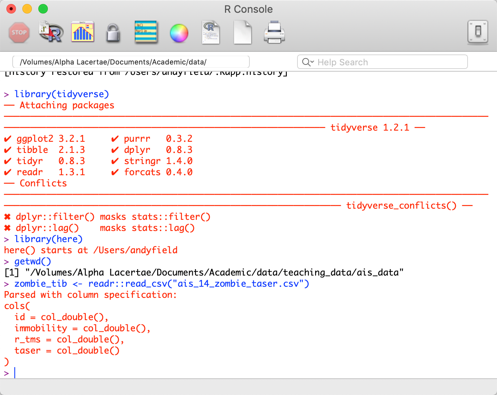
]

???

Left image of R logo, right image of Base R window, showing that it looks ugly and difficult to use.

---

background-image: url(images/morty_scream.jpg)
background-size: cover

???

Image of Morty from Rick and Morty screaming in pardoy of Edvard Munch's 'The Scream'.

---

.pull-left[

]
--
.pull-right[

]


???

Top image of R Studio logo, bottom image of R logo.

---

background-image: url(images/rick_smiling.jpg)
background-size: cover

???

Image of Rick from Rick and Morty smiling maniacally.

---
##  R and R Studio 

### R

+ Free software environment for statistical analysis and graphics

--

### R Studio

+ A free integrated development environment (IDE) for R
+ You use R Studio as a way to interact with R
  + Install R and forget about it until such time that you need to update it
	+ Install RStudio 
	+ Set up RStudio to suit your personality and enjoy your status as rad data scientist hipster

---
##  Why R? 

Transferable skills

--

R is the most widely used data analysis software

--

Reproducible science

--

Cutting edge

--

One stop shop

--

RStudio is amazeballs


---

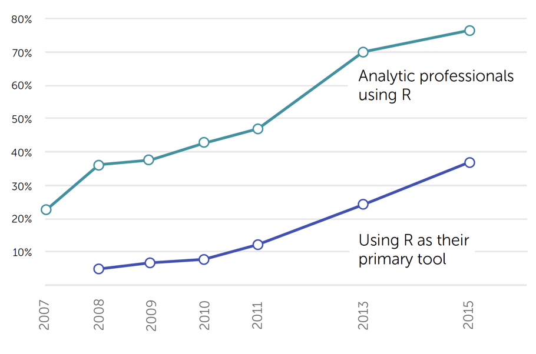


---

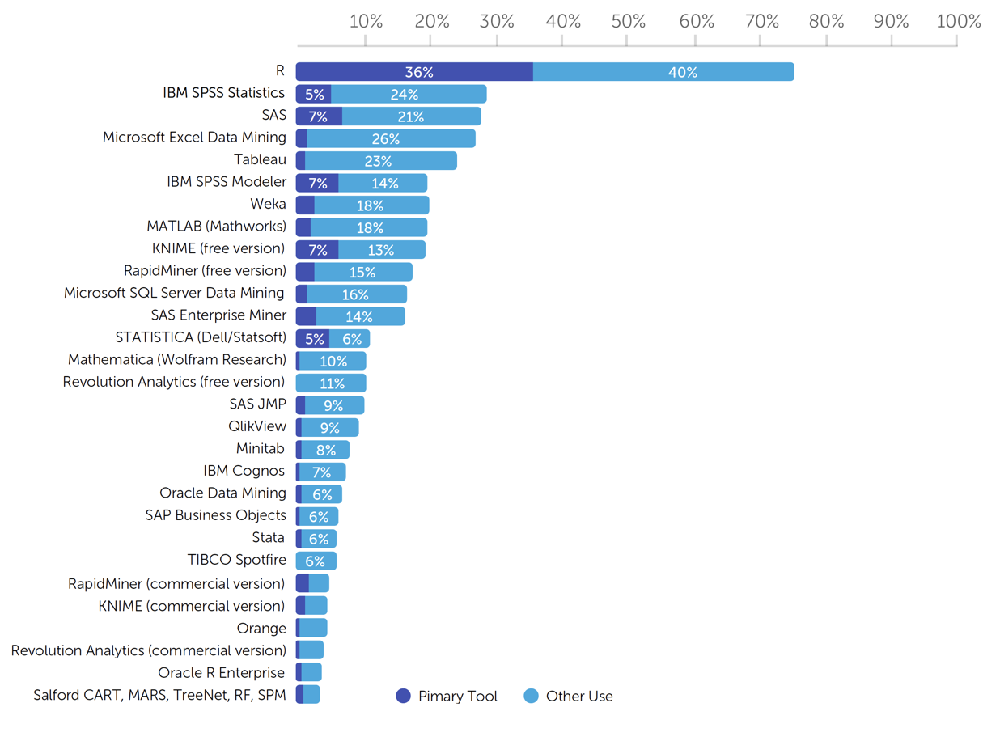


---
##  Starting up R Studio 

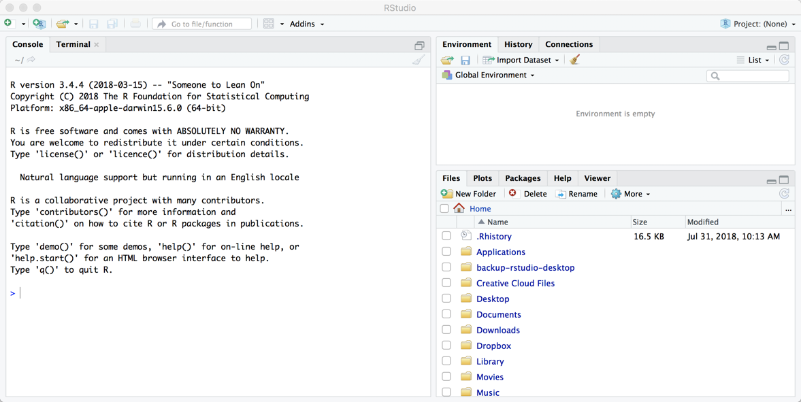

---

.pull-left[
###  Try it! Colour scheme 

+ Windows
  + .font-bwn[Tools > Options] 
+ MacOS
  + .font-bwn[Tools > Global Options]
  + .font-bwn[RStudio* *> Preferences]
]

.pull-right[
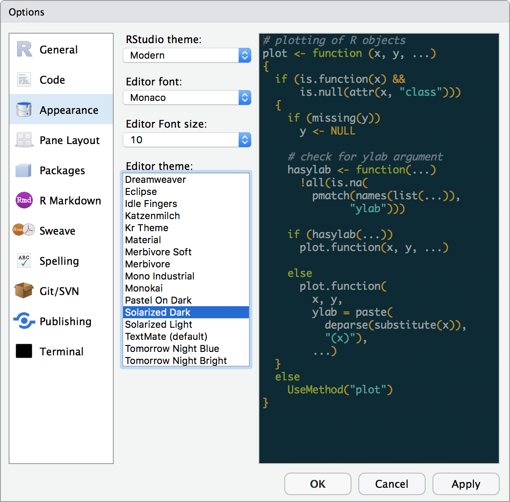
]

???

Image of the dialog box for editing the colour scheme of RStudio

---
.pull-left[
###  Try it! Pane locations

]

.pull-right[
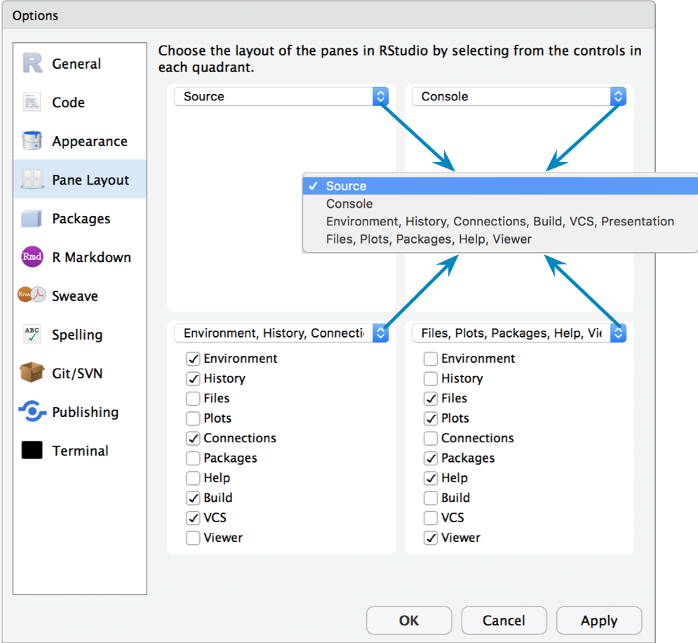
]

???

Image of the dialog box for editing the location of panes in RStudio


---

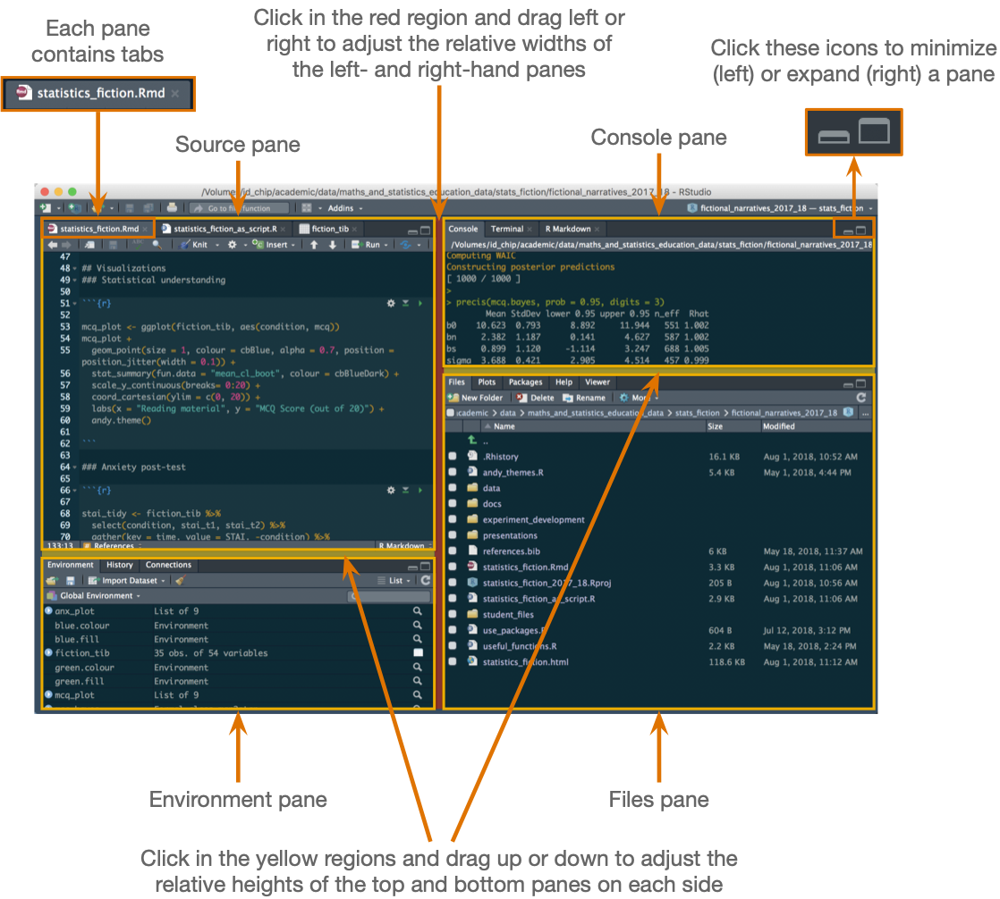

???

Image of the RStudio interface

---
class: inverse
layout: false

background-image: url("images/ais_powerpoint_blue.png")
background-size: cover

#  Part 2: Workflow in RStudio

---
layout: true
background-image: url("images/ais_powerpoint_white.png")
background-size: cover
---
##  Before we begin …. 

University computers are networked and use something called UNC paths

--

This messes a few things up

--

There’s a fix:

+ On CANVAS go to .font-bwn[Files > system_files]
+ Download the file .font-bwn[.Renviron]
+ Save it to the Documents folder on the N: drive

--

.font-orn[NOTE: you don’t need to do this on your home machine/laptop]

---


???

Image of the Sussex one drive logo.
We will save files to Sussex one drive.

---
##  R Studio project files 

A file created by R Studio with the extension .font-bwn[.Rproj]
+ Stores information about the containing folder
+ Restores the previous state of the project (i.e. what documents/tabs were open)

--

Opening a project file sets the working directory to the folder containing the project file
  + You can use relative file paths
  + The project will work on any machine you care to use
  + You can share your project folder with others and it’ll work for them

--

.font-orn[Use project files!]

---
###  Get organized!

`C:/Users/andyfield/Documents/my_new_project/data/my_funky_data.csv`
.pull-left[
`./data/my_funky_data.csv`

`../data/my_funky_data.csv`
]

.pull-right[
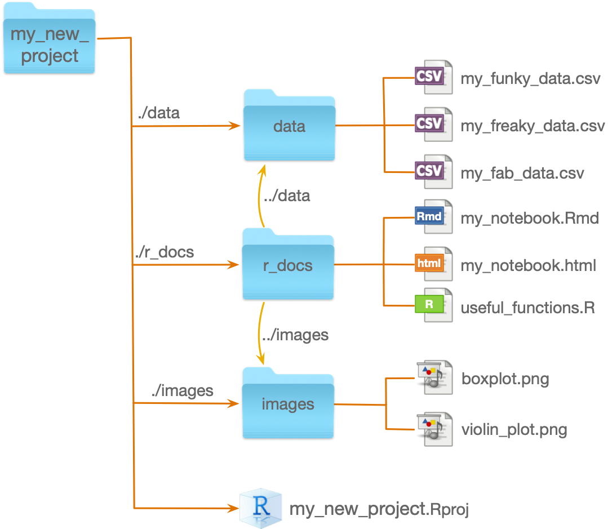
]

---
##  Creating a project: .font-bwn[File > New Project] 

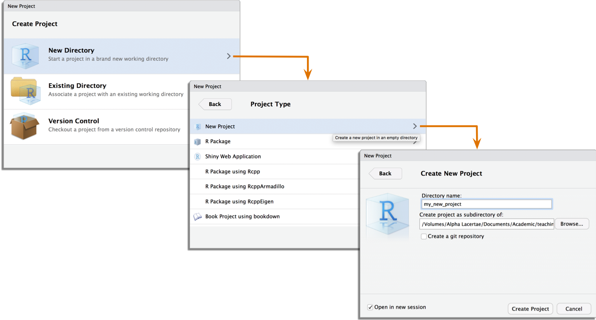

---
##  Try it! 

Create an R Studio project called .font-bwn[my_adventr] on .font-bwn[Sussex One Drive]

--

Within it create folders called
+ .font-bwn[data]
+ .font-bwn[r_docs]
  
--

Create a markdown file
+ Use the .font-bwn[File > New File > R Markdown …] menu
+ Save it to the .font-bwn[r_docs] folder with the name .font-bwn[sample_tap.Rmd]

---
##  Now, let’s save some data 

On CANVAS go to .font-bwn[Files > data_files]

Download the sample TAP data (.font-bwn[tap_parenting.csv])

Copy the file into the data folder of your project


---
class: inverse
layout: false

background-image: url("images/ais_powerpoint_blue.png")
background-size: cover

#  Part 3: Interacting with R

---
layout: true
background-image: url("images/ais_powerpoint_white.png")
background-size: cover
---
##  Interacting with R 

Direct to the console (boo!)
+ Bad for reproducibility/your sanity

--

Script files (meh!)
+ Great for reproducibility
+ Bad for integrating analysis into documents

--

R markdown document (hooray!)
+ Great for reproducibility
+ Great for integrating analysis into documents
+ Great for impressing your friends and loved ones

---
##  Try it 

Type these commands into the console one-by-one and press return

```{r, eval=FALSE}
plot(pressure)
cor(pressure)
```

---

```{r}
plot(pressure)
```

---
```{r}
cor(pressure)
```

---


---

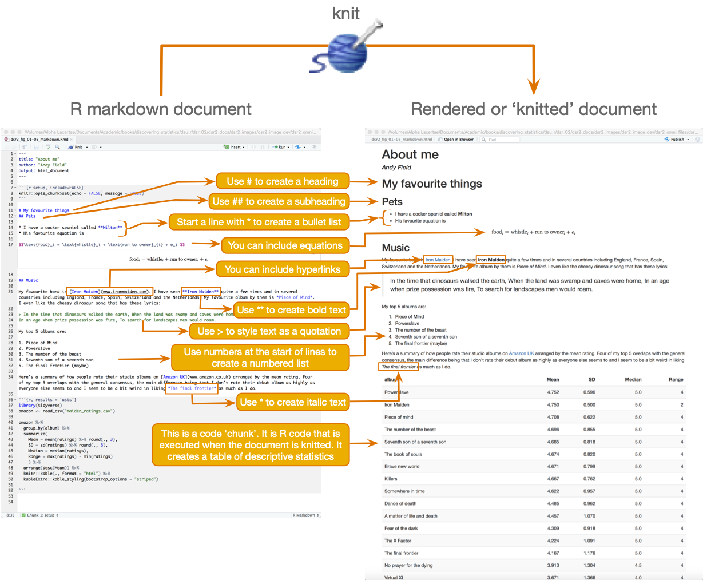

---

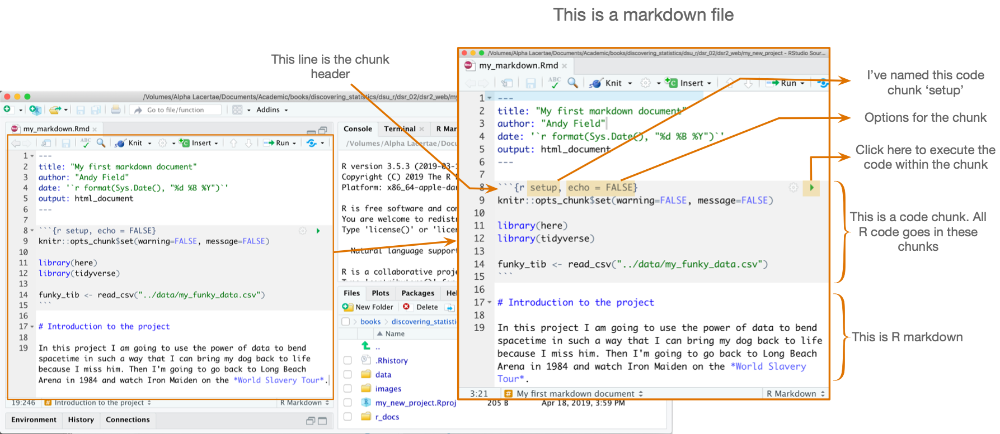


---
##  Inserting code chunks

Windows
+ *ctrl + alt + i*
+ .font-bwn[Code > Insert Chunk]

Mac
+ *cmd + opt + i* (⌘ + ⌥ + i)
+ .font-bwn[Code > Insert Chunk]


---
## Try it 

In your *sample_tap.Rmd* file
+ Create a code chunk, type the first command into it and execute.

```{r, eval = FALSE}
plot(pressure)
```

+ Create a new code chunk, type the second command into it and execute.

```{r, eval = FALSE}
cor(pressure)
```

+ ‘Knit’ the document


---
##  Code chunk options 

+ `echo=FALSE`: the code will be evaluated but not reproduced in the knitted document.
+ `eval=FALSE`: the code will not be evaluated.
+ `include=FALSE`: RStudio will evaluate the code but neither the code nor output are displayed in the knitted document.
+ `results="hide"`: the code will be evaluated and displayed in the knitted document but the output will be omitted.
+ Include `fig.width=9` and `fig.height=5` to set the dimensions of an image
	+ Obviously replace 9 and 5 with the values you want
+ Use `results = 'asis'` when creating tables from code/output


---
##  Try it! 

+ Using the code chunks we have already created
+ Change the code chunk headers to include `echo=FALSE` , re-knit the document and compare the result.
+ Repeat this process but including `eval=FALSE`

---
## R Markdown: headers 

.pull-left[
Markdown
+ `# Level 1 heading`
+ `## Level 2 heading`
+ `### Level 3 heading`
+ `#### Level 4 heading`
]

.pull-right[
Knitted text
+ # Level 1 heading
+ ## Level 2 heading
+ ### Level 3 heading
+ #### Level 4 heading
]

---
##  R Markdown: lists 

.pull-left[
Markdown
```{r, eval = FALSE}
* This is the first bullet point
  + this is a sub-bullet
  + so is this
* This is the second bullet
  + This is a sub-bullet
    - A third layer of bullet madness
    - It had to be done
* This is the third main bullet
```
]

.pull-right[
Knitted text
+ This is the first bullet point
  + this is a sub-bullet
  + so is this
+ This is the second bullet
  + This is a sub-bullet
      - A third layer of bullet madness
      - It had to be done
+ and this is the third bullet
]


---
##  R Markdown: emphasizing text 

.pull-left[
Markdown
```{r, eval = FALSE}
*italic text*
**bold text**
Text^superscript^
Text~subscript~
```
]

.pull-right[
Knitted text

*italic text*

**bold text**
$$\text{Text}^\text{superscript}$$ 
$$\text{Text}_\text{subscript}$$ 
]


---
##  R Markdown: hyperlinks 

### Markdown

`The *adventr* is a package of interactive tutorials for learning R. Get it from [milton-the-cat.rocks/home/adventr.html](http://milton-the-cat.rocks/home/adventr.html)`

### Knitted text

The *adventr* is a package of interactive tutorials for learning R. Get it from [milton-the-cat.rocks/home/adventr.html](http://milton-the-cat.rocks/home/adventr.html)

---
##  R Markdown: equations 

### Markdown

We can include the linear model in its own paragraph like this: 
```{r, eval = FALSE}
$$ Y_i = b_0 + b_1X_i + \epsilon_i $$
```

### Knitted text

We can include the linear model in its own paragraph like this:

$$Y_i = b_0 + b_1X_i + \epsilon_i$$


---
##  Try it! 

In your markdown file create a level 1 header that reads 'About me'

Write a sentence or two about yourself using bold and italic somewhere

Create a level two heading 'My favourite things’

Within that section write a list of five of your favoutite things (could be books, movies, bands, songs, statisticians). Include a URL to one of them.

---
class: inverse
layout: false

background-image: url("images/ais_powerpoint_blue.png")
background-size: cover

#  Part 4: Doing things in R

---
layout: true
background-image: url("images/ais_powerpoint_white.png")
background-size: cover
---
##  Getting help 

To get help, use the `help()` function or `?`
+ `help(thing_you_want_help_with)`
+ `?thing_you_want_help_with`

Execute help commands at the command line
+ .font-orn[Do NOT include] `help()` .font-orn[in markdown files]

Try accessing the help files for the `mean()` function, by executing:
+ `?mean`

---
##  R Style Wickham (2014)

R is case sensitive. In code chunks use lower case wherever possible

--

Variable and function names should be lowercase with an underscore (_) to separate words
+ Names should be concise and meaningful
+ A variable representing children’s’ anxiety levels might be named `child_anxiety`
+ `scores_on_the_child_manifest_anxiety_scale` is meaningful but too long, and `ca` is concise but not meaningful

--

Place spaces around all operators (`=`, `+`, `-`, `<-`) to make code easier on the eye!

--

My practice: use consistent suffixes that identify types of objects
+ `_tib` to denote a tibble (more them later), e.g. `anx_tib` for a tibble of data relating to anxiety
+ `_mod` to denote a model (e.g., `anx_mod` for a model in which child anxiety is predicted
+ `_out` to denote output (e.g., `anx_out` contains the summary output from the above model

---
##  Functions and objects 

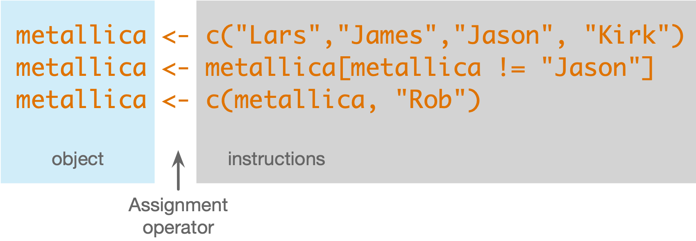

---
##  Try It! 

```{r}
metallica <- c("Lars", "James", "Kirk", "Rob")
metallica
```


---
##  Installing and loading packages 

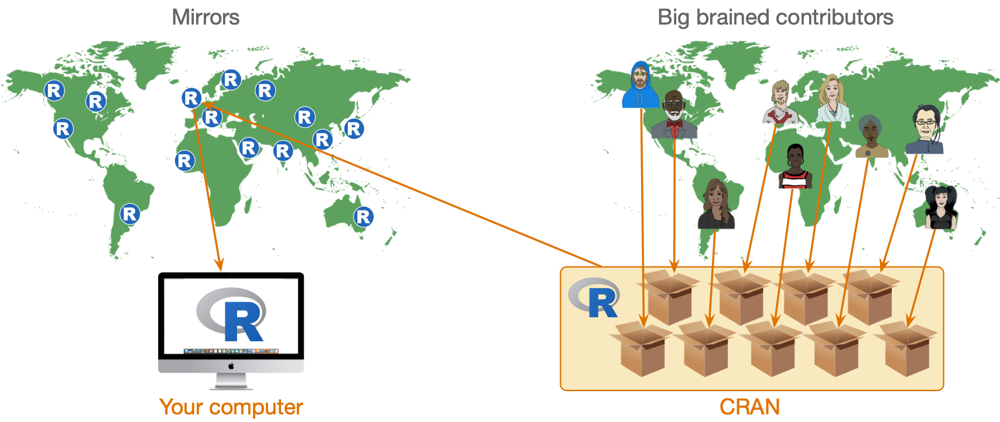

---
##  Installing and loading packages 

Install the package from CRAN
+ You need to install the package into R’s repository of packages on your computer.
+ Every time you update or re-install R you need to re-install packages to use them.
+ `install.packages("package_name")`
+ .font-orn[Install packages using the command line. Do NOT include] `install.packages()` .font-orn[in markdown files or the package will be installed every time you knit the document]

--

Load the package
+ To use a particular package in a current session load it from the repository.
+ `library(package_name)`

--

Try it!
+ Execute `install.packages("tidyverse")`


---
##  The tidyverse 

A set of packages built upon a common philosophy of data science


---

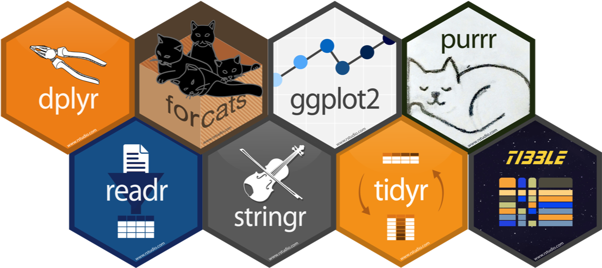

???

Image: montage of tidyverse package logos

---
##  The pipe operator (`%>%`)

Multiple commands:
```{r, eval=FALSE}
core_members <- subset(metallica, metallica != "Rob")
core_members <- sort(core_members)
```

--

Nested commands:
```{r, eval=FALSE}
core_members <- sort(subset(metallica, metallica != "Rob"))
```

--

Piped commands:
```{r, eval=FALSE}
core_members <- metallica %>%
  subset(., metallica != "Rob") %>%
  sort()
```

--

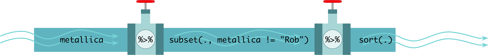


---
##  Using a ‘setup’ code chunk 

I advise you have a setup chunk that
+ Sets global options for your code chunks
+ Loads all of the packages you plan to use (in alphabetic order)
+ Loads any data that you plan to use

--

```{r, eval=FALSE}
knitr::opts_chunk$set(echo = TRUE, warning=FALSE, message=FALSE)

library(here)
library(kableExtra)
library(tidyverse)

tap_tib <- readr::read_csv("/Volumes/the_repository/documents/Academic/teaching/an_adventure_in_statistics/my_adventr/data")
```

---
##  Filepaths made easy (well, easier …) 

### Relative paths
If you use an RStudio project, you can use relative paths
+ `tap_tib <- readr::read_csv("../data/tap_parenting.csv")`

--

### The `here` package

If you use an RStudio project, `here::here()` returns the project folder
+ Text within `here()` returns the folder or file within the project folder that matches the text
+ `tap_tib <- here::here("data/tap_parenting.csv") %>% readr::read_csv()`

---
```{r}
library(here)
here::here()
here::here("data")
here::here("data/tap_parenting.csv")
```
---

```{r, eval = FALSE}
knitr::opts_chunk$set(warning=FALSE, message=FALSE)

library(kableExtra)
library(tidyverse)

tap_tib <- readr::read_csv("../data/tap_parenting.csv")
```

--

```{r, eval = FALSE}
knitr::opts_chunk$set(warning=FALSE, message=FALSE)

library(here)
library(kableExtra)
library(tidyverse)

tap_tib <- here::here("data/tap_parenting.csv") %>%
  readr::read_csv()
```

---
##  Messy vs. Tidy data 

### Messy data (aka 'wide' data)

What IBM SPSS Statistics uses
+ Each row represents a unique case/entity

--

### Tidy data (aka 'long' data)
What many (but not all) R functions require
+ Each row represents an instance of the outcome measure
+ Rows code information about that 'instance'


---

```{r, eval = FALSE}
tap_tib <- here::here("data/tap_parenting.csv") %>%
  readr::read_csv()

tap_tib
```

```{r, echo = FALSE, results = 'asis', messages = FALSE}
tap_tib %>%
  dplyr::arrange(id) %>% 
  head(10) %>%
  knitr::kable(caption = "tap_parenting.csv") %>% 
  kableExtra::kable_styling(bootstrap_options = "striped")
```


---
class: inverse
layout: false

background-image: url("images/ais_powerpoint_blue.png")
background-size: cover

#  Part 5: Getting the most from practical classes

---
layout: true
background-image: url("images/ais_powerpoint_white.png")
background-size: cover
---
##  Practical classes 

The practical classes are based on a package of interactive tutorials called `adventr` that I wrote
+ Students work at your own pace
+ You can work with friends/peers to support each other.
+ Tutors will wander around giving you one-to-one help when you need it

---
##  Installing adventr 

```{r, eval=FALSE}
install.packages("remotes")
library(remotes)
remotes::install_github("profandyfield/adventr")
```

--

## Running a tutorial

```{r, eval=FALSE}
library(adventr)
learnr::run_tutorial("name_of_tutorial", package = "adventr")
learnr::run_tutorial("adventr_03", package = "adventr")
```


---
##  Suggested workflow 

Create an RStudio project called .font-bwn[my_advent]
+ Within it create folders called .font-bwn[data] and .font-bwn[r_docs]
+ Save all of the data files for the tutorials (on Canvas) into the .font-bwn[data] folder
+ Save the file .font-bwn[tutorial_template.Rmd] into your .font-bwn[r_docs] folder

---
##  Suggested workflow (cont.)

For a given tutorial, have **two** RStudio sessions running simultaneously
+ To open a second session select .font-bwn[Session > New Session]

--

Session 1: run the tutorial
```{r, eval=FALSE}
library(adventr)
learnr::run_tutorial("adventr_03", package = "adventr")
```

--

Session 2: make notes
+ Open the file .font-bwn[tutorial_template.Rmd] and save it with a name related to the tutorial
+ As you work through the tutorial, copy the code you've written in the tutorial into code chunks in the Rmarkdown file
+ Make notes (for example, anything you didn't understand at first, or things to help you remember what you did and why you did it). This will help with your reflective statements
+ Save the markdown file for future reference, and/or knit it into an html document


